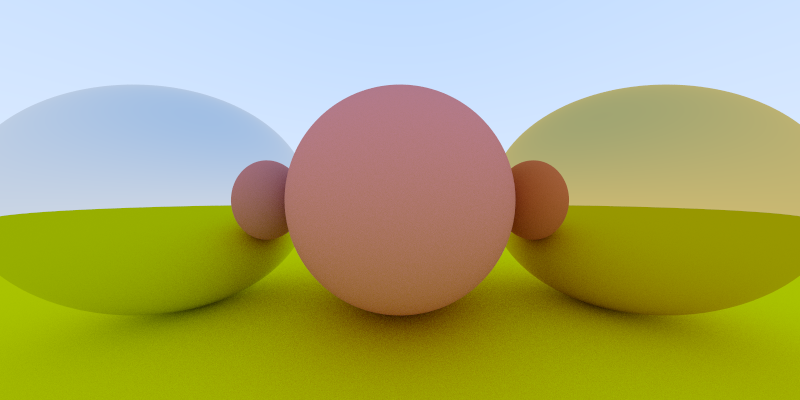

## Perter Shirley one week ray tracing

using Eigein(https://eigen.tuxfamily.org) as linear algebra lib  and CImg(https://cimg.eu) to save images, small adjusment to original design ( using std::optional and always returning strutcs, never passing non const references to methods)

